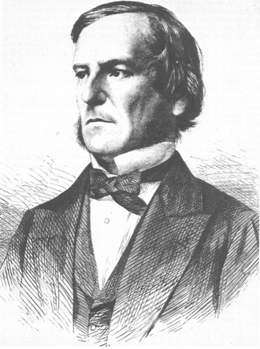

<style>
.columns {
  display: flex;
  gap: 50px;
  align-items: center;
}
.columns img {
  max-width: 40%;
  height: auto;
}
.columns .text {
  flex: 1;
}
</style>


# Изучаем язык Python
## Занятие 4 - Логические (булевы) значения


---

## Логические значения

Во многих языках программиования есть логический тип данных. Этот тип имеет всего два значения:

```python
# файл ex-004-01.py
logic1 = True  # Истина
logic2 = False  # Ложь
print(logic1, logic2)
# >True False

```
Логический тип также называют булевым, по имени английского ученого Джорджа Буля.

---


<div class="columns">
  
  <div class="text">
  
  # Джордж Буль
  
2 ноября 1815 - 8 декабря 1864 
  
(49 лет)

  </div>
</div>

---

## Условия имеют логический тип

Логические значения позволяют нам по-новому взглянуть на условия и сравнения, а также сложные условия. Оказывается все это относится к логическому типу данных и операциям с логическими значениями.

Условия и сравнения теперь мы можем присваивать обычным переменным и использовать в программе по своему усмотрению.

```python
# файл ex-004-02.py
a = 5  
b = 2  
logic = a > b
print(logic)
# >True
```

---

## Логические операторы not, and, or

На самом деле сложные условия, которые мы изучали ранее реализуются с помощью
логических опреторов

```python
# файл ex-004-03.py
logic1 = True   
logic2 = False
logic3 = logic1 and logic2   
logic4 = logic1 or logic2   
logic5 = not logic4
print(logic1, logic2, logic3, logic4, logic5)
# >True False  False True False
```

---

## Таблицы истинности

Как для чисел существуют таблицы умножения, так и для логических значений существуют свои таблицы. Они называются таблицами истинности.

Для простейшего оператора **not** таблица истинности выглядит так:

| a     | not a    |
|-------|:-----:   |
| **False** |   True   |
| **True**  |   False  |

---

## Таблица истинности для **and**


| a \ b | False | True |
|-------|:-:|:-:|
| **False** |  False |  False |
| **True** |  False | True |       

---

## Таблица истинности для **or**


| a \ b | False | True |
|-------|:-:|:-:|
| **False** |  False |  True |
| **True** |  True | True |       

---

## Задача - Логическое выражение

Вычислите значения выражения

(A and not B) or (not A and B) 

для всех допустимых значений A и B
постройте таблицу истинности данной функции


