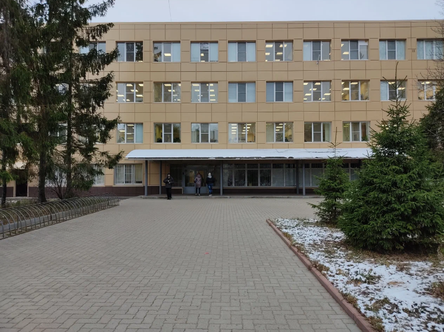
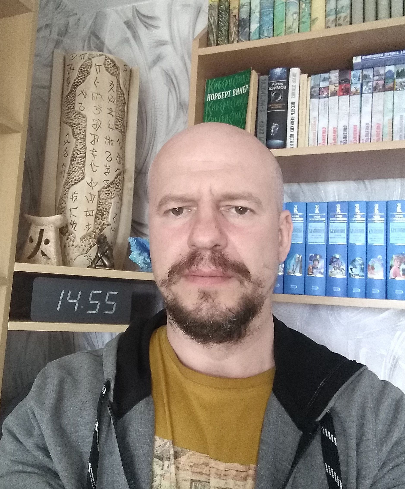
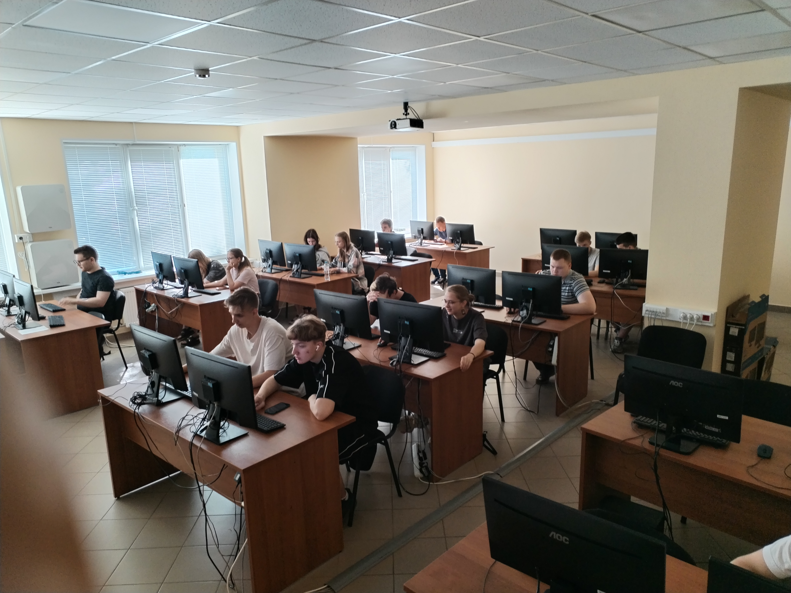

# Школа программирования DEVELOBEAR

Приглашаем школьников старших классов из Рыбинска на занятия по программированию в ИТ-школе DEVELOBEAR.

## Занятия ведутся на базе НПО Криста.

НПО Криста - ведущее современное ИТ-предприятие не только по меркам Рыбинска, но и в масштабе всей страны. Программное обеспечение, разрабатываемое в Кристе используется по всей Росиии. НПО Криста имеет филиалы в Москве, Ярославле и других городах. Специалисты НПО Криста имеют высокий уровень теоретическои и практической подготовки и пользуются самыми современными технологиями. НПО Криста официально сертифицирована, как ИТ-компания в российском реестре ИТ-компаний.

## Занятия ведутся на языке Java

Язык Java - современный многофункциональный промышленный язык общего назначения. На нем одинакого хорошо решать школьные задачи, выполнять серьезные научные вычисления, строить современные, масштабируемые информационные системы. 

Язык Java имеет простой и выразительный синтаксис, мощную систему библиотек, усиленный котнтроль за ошибками на всех уровнях. Пока другие ищут ошибки в коде - программист Java уже получает результат. 

В свое время Java совершил революцию в подходе к програмированию. По его подобию стали строится многие другие языки. Java - это классика, не перставшая быть современной. Java широко используется в корпоративном и банковском секторе, мобильной разработке, криптографии, научных вычислениях. В НПО Криста Java - один из основных языков разработки.

Код на языке Java допускается в качестве решения во всех олимпиадах и соревнованиях по программированию.

## Системный подход к знаниям

К сожалению в современное время множество онлайн школ и курсов используют поверхностный подход к обучению программированию из-за чего возникает множество проблем. Одна из них - сложности с трудоустройством и дальнейшей работой в ИТ-секторе. Неспособность решать задачи, требуюшие математики, логики, теоретического и системного подхода. Разочарование в профессии програмиста, отсутствие каръерного роста.

В школе DEVELOBEAR обучение проходит в духе понимания, а не заучивания. Упор делается на общие системные и математические принципы обработки информации. Вместе с практическими занятиями даются основы системных знаний. На каждом занятии присутствет обучение, решение практических задач и разбирается интересная теоретическая тема.

## Преподаватель

Занятие ведет Михаил Долгих (50 лет) - инженер, выпускник РГАТУ, победитель школьных и всероссийских студенческих олимпиад в области информатики и компьютерной графики. Преподаватель имеет серьезный практический опыт в промышленном программировании.

## Приходите - будет интересно

Занятия проходят в уютном и хорошо обрудованном учебном классе НПО Криста - по адресу:  **Рыбинск 1-я Выборгская ул., 50, аудитория 321**.

Занятия проводятся каждый четверг с 17 до 20 часов.

Первое занятие: **4 сентября 2025 года**.

# План занятий

## Занятие 1: Начало работы
- Среда программирования VSCode
- Написание первой программы
- Компилирование и запуск
- Создание перменных
- Типы данных
- Добавление комментариев
- Виды ошибок - ошибки компиляции, ошибки времени исполнения,
  ошибки в логике работы 
- Решение проблем и отладка
- **Задача:** возведение числа в 8 степень. 
- **Мини-лекция:** история языка Java 

## Занятие 2: Выполнение операций
- Арифметические операции
- Присвоение переменным
- Сравнение зачений
- Логические переменные
- Тренарый оператор
- Приоритет операций
- **Задача:** решение квадратного уравнения
- **Мини-лекция:** какие бывают языки программирования - место
языка Java среди других. 

## Занятие 3: Управление выполнением
- Оператор ветвления if
- Ветка else
- Оператор switch 
- Цикл for
- Цикл while
- Цикл do-while
- Команды break и continue
- **Задача:** подсчет суммы гармонического ряда
- **Задача:** подсчет суммы простых чисел от 2 до n
- **Мини-лекция:** как устроены компьютеры - микропроцессоры, память, накопители, специализированные процессоры 

## Занятие 4: Типы данных
- Java - строго типизированный язык
- Преобразования типов
- Математические функции
- Округление
- Случайные числа
- Форматирование чисел
- **Задача:** моделирование нормального распределения.
- **Задача:** нахождение корней функции (бинарный поиск)
- **Мини-лекция:** история вычислительной техники и информационных технологий - прошлое и будущее. 

## Занятие 5: Работа со строками
- Работа со стоками
- Сравнение строк
- Поиск в строках
- Работа с символами
- Принципы тестования кода
- **Задача:**: поиск палиндромов и анаграмм 
- **Мини-лекция:** надежность ПО, важность тестирования, виды тестирования, принципы TDD

## Занятие 6: Массивы
- Что такое массивы
- Создание и инициализация
- Итерации по массиву
- Сортировка и поиск
- Многомерные массивы
- **Задача:**: сложение и умножение матриц  
- **Мини-лекция:** - современная криптография, симметричное и ассиметричное шифрование, закрытый и открытый ключ, методы обмена ключами, методы разделеня секретов. Блок-chain, криптовалюты, биткоин.

## Занятие 7: Функции и подпрограммы.
- Разбиение кода на части: декомпозиция задачи
- Функции и процедуры - в чем разница?
- Чистые функции и функции с эффектами
- Вызов функций из другого файла
- Принципы организации модулей и библиотек
- Приемы проектирования API
- **Задача:**: оформление библиотеки работы с матрицами
- **Мини-лекция:** Теория алгоритмов, проблема останова, машина Тьюринга, проблема вычислимости, оценка сложности алгоритмов, NP-полные задачи

## Занятие 8: Ввод-вывод
- Стандартный ввод-вывод
- Перенаправление OC
- Организация конвееров
- Работа с файловой системой
- Чтение файлов
- Запись файлов
- **Задача:**: подсчет симолов и строк в тексте
использование принципа конвеера для фильтрации 
- **Мини-лекция:** Операционные системы - Windows, Linux, MacOs, Android, iOs, встраиваемые OC, ОС реального времени, специализированные ОС

## Занятие 9: Курсовая работа: Задача о блуждающей собаке
- Постановка задачи
- Декомпозиция задачи
- Написание тестов
- Написание рабочих функций
- Вывод на экран
- Вариант в трех измерениях
- Анализ результатов
- **Мини-лекция:** теория вероятностей, теория игр, численные методы, методы оптимизации

## Занятие 10: Продвинутая тема: классы и объекты
- Проблема сложности и принципы ООП
- Объекты: умный тип данных
- Написание класса объекта
- Использование объектов: создание и уничтожение
- Инкапсуляция свойств - области видимости
- Немного о наследовании и полиморфизме
- Про память и сборку мусора
- **Задача:** моделирование движения по перекрестку: люди, машины, велосипедисты, собаки
- **Мини-лекция:** Отличные от ООП подходы к программированию. Функциональное и декларативное программирование, лямбда-исчисление, решатели, методы автоматизированных доказательств, языки LISP, PROLOG, HASKELL, COQ, AGDA, IRDIS

## Занятие 11: Продвинутая тема: Контейнерные типы данных
- List
- Map
- Set
- Сортировка и фильтрация
- Унифицированная обработка - Stream API
- Примеры использования
- **Задача:** подсчет частоты символов и слов в тексте
- **Мини-лекция:**  промышленное программирование, современные принципы создания программных систем, борьба со сложностью,
надежность ПО

## Занятие 12: Продвинутая тема: работа с сетью
- Необходимость взаимодействия компьютеров
- Серверы и клиенты: как это устроено
- Сетевые библиотеки Java
- HTTP, HHTPS, HTML
- XML, JSON, Вэб сервисы - сайты для компьютеров.
- **Задача** - скачивание и парсинг страницы сайта (например Кристы) 
- **Мини-лекция:** компьютерные сети, TCP/IP, DNS, WWW, распределенные вычисления, микросервисы, docker и kubernetos.

## Занятие 13: Продвинутайя тема: компьютерная графика
- Принципы работы в трехмерном пространстве
- Основы тригонометрии
- Расчеты с помощью матриц
- Расчет движения - повороты и переносы
- Вывод на экран - перспектива
- Принципы работы современных 3D видеокарт
- Принципы построения игр и виртуальной рельности
- **Задача:** вывод на экран вращающегося тетраэдра
- **Мини-лекция:** САПР - математическое моделирование, принципы математического описания геометрии, поверхностей, тел, и физических свойств. Пректирование полного цикла - 
станки ЧПУ, 3D-печать. 

## Занятие 14: Продвинутая тема: рекурсия и рекурсивные типы данных
- Принцип рекурсии
- Простой пример - вычисление факториала
- Другой пример - числа Фибоначчи
- Ссылочные типы данных: списки и деревья
- Рекурсивный алгоритм обхода дерева
- Прверка на выход и другие сложности
- Неявная рекурсия, взаимная рекурсия
- **Задача:** вычисление определителя матрицы
- **Мини-лекция:** Внутри ИТ-компании - договоры, сроки, бюджеты, HR, менеджмент, управление проектами, карьера разработчика

## Занятия для задач DEVELOBEAR

## Завершающее занятие - выдача дипломов

**Лекция - Перспективы для разработчика: будущее вычислительной техники и ИТ** 

- цифровая трансформация - цифровое предприятие, цифровой город, цифровое государство
- финтех - банковский сетор
- большие данные - BigData, Data Sience 
- архитектуры параллельных вычислений, кластеры, суперкомпьютеры
- искусственный интеллект - ML, LLM, ИИ, AGI, нейронные сети и нейроморфные вычисления
- квантовые вычисления
- программно-аппаратные комплексы повышенной надежности
- биоинформатика
- движение OpenSource

