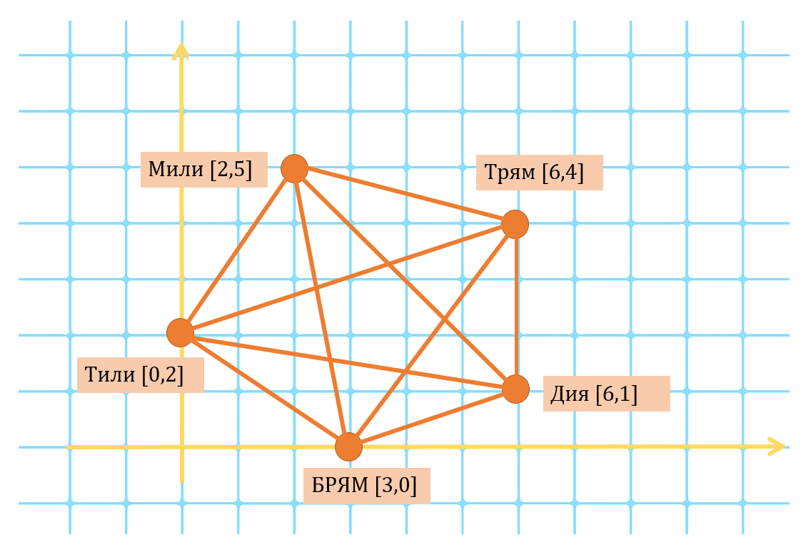

## Задача: Страна ТилиМилиТрямДия

В стране ТилиМилиТрямДия четыре города Тили Мили Трям и Дия. Плюс столица БРЯМ.

Это маленькая страна и чтобы она всем казалась больше правитель выпустил указ - считать периметром страны сумму всех прямых между городами, а площадь страны - сумма площадей всех треугольников, которые можно построить между городами.

Найдите во сколько раз в результате этого указа увеличился периметр и площадь ТилиМилиТрямДии.

---

